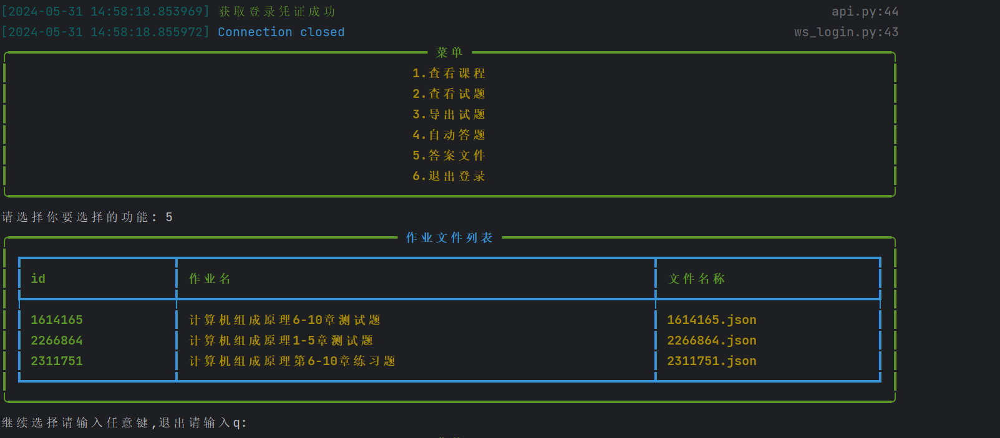

<div align="center">
    <h1 align="center">
     雨课堂 作业 一键完成（全新版本✨✨✨）
    </h1>

<p>该脚本仅用于爬虫技术的学习，如果你有好的功能或者想法，欢迎提交pr</p>
<p>🛸注意：该脚本完成作业的答案需要从已完成作业账号中导出，仅适合自用！！！（无视老师设置的不允许查看试卷）</p>
</div>

## 1.使用方法

#### 1.克隆到本地
```bash
git clone https://github.com/aglorice/Raincourse.git
```

#### 2.进入目录
```bash
cd new_xxt
```
#### 3.安装依赖
```bash
pip install -r requirements.txt
```
#### 4.运行`main.py`
```bash
python main.py
```
## 2.使用方法

## 3.运行实例


## 4️.注意事项
- 仓库发布的`new_xxt`项目中涉及的任何脚本，仅用于测试和学习研究，禁止用于商业用途，不能保证其合法性，准确性，完整性和有效性，请根据情况自行判断。
- 本项目遵循MIT License协议，如果本特别声明与MIT License协议有冲突之处，以本特别声明为准。
- 以任何方式查看此项目的人或直接或间接使用`new_xxt`项目的任何脚本的使用者都应仔细阅读此声明。`aglorice` 保留随时更改或补充此免责声明的权利。一旦使用并复制了任何相关脚本或`new_xxt`项目，则视为您已接受此免责声明。


### 如果你觉得不错的话，就请我吃颗糖吧。😁😁😁


### Star History

[](https://star-history.com/#aglorice/Raincourse&Date)